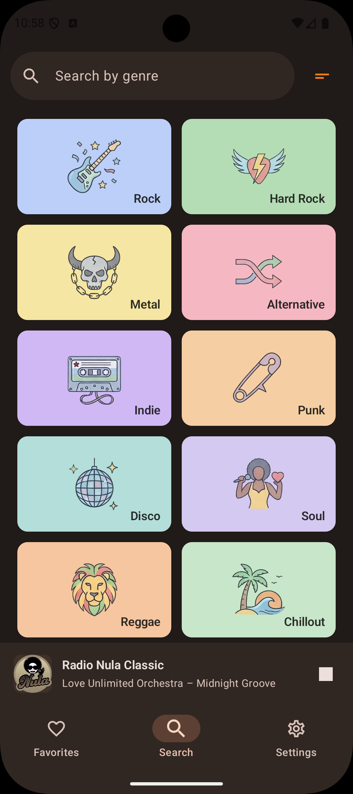
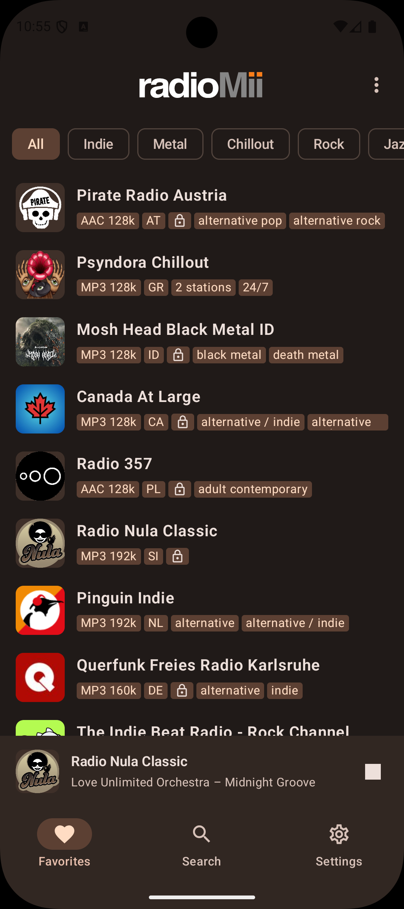
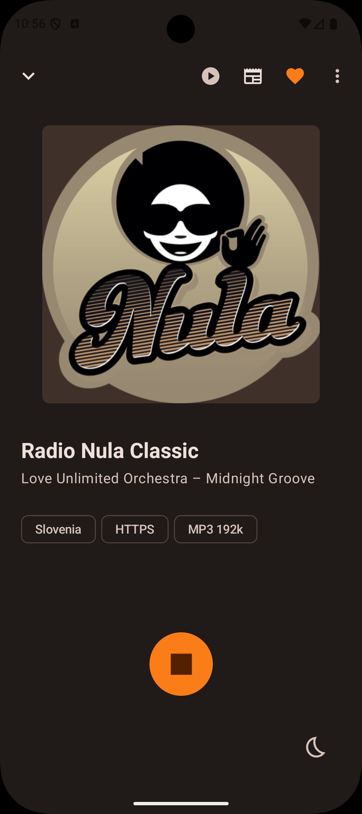
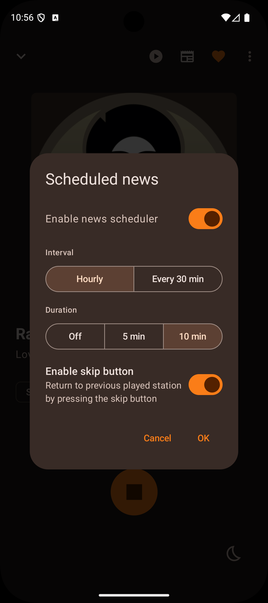
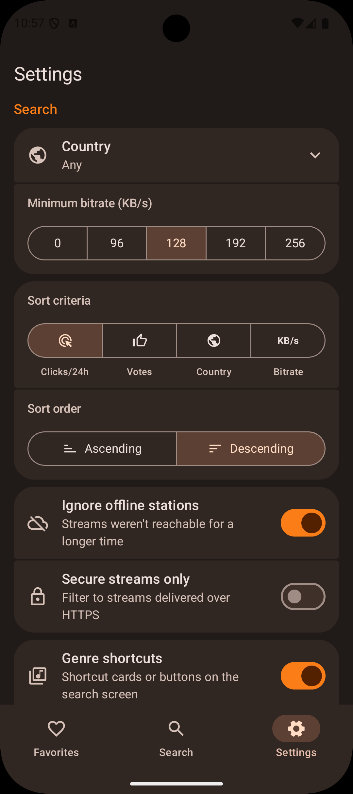
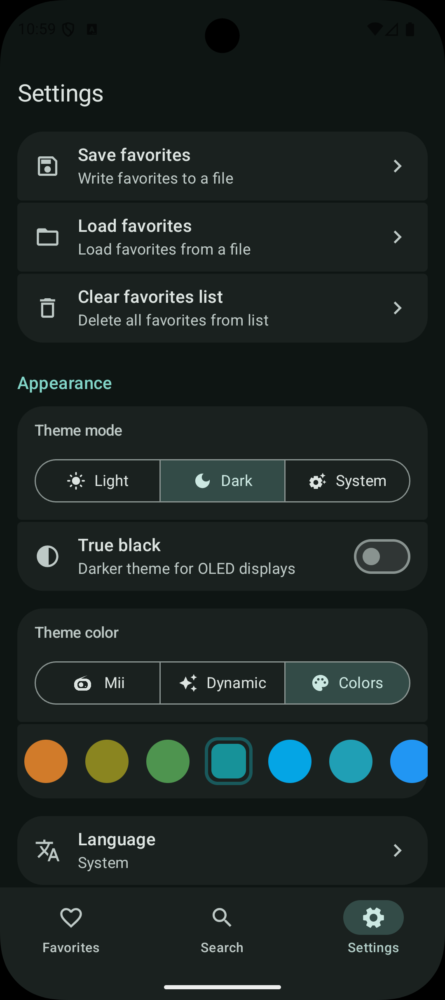

<p align="center" style="margin-top: 20px; margin-bottom: 40px;">
  
</p>

[](https://www.gnu.org/licenses/gpl-3.0)
[](https://github.com/haecksenwerk/radioMii-android/releases/latest)
[](https://ko-fi.com/haecksenwerk)

**Mii** 美音 &nbsp;·&nbsp; 美 _(beautiful)_ 音 _(sound)_

A modern Android app for browsing and playing internet radio streams, built with Kotlin and Jetpack Compose (Material 3), based on the radioMii [React web app](https://www.radiomii.com).

Station data is sourced from the community-maintained [radio-browser.info](https://www.radio-browser.info/) API.

---

<p align="center">
  
  
  
  
  
  
</p>

---

## Installation

### Obtainium

The easiest way to install and keep radioMii up to date is via [Obtainium](https://github.com/ImranR98/Obtainium) - it fetches updates directly from GitHub Releases, no app store required.

1. Install [Obtainium](https://github.com/ImranR98/Obtainium)
2. Add the following URL as a new app source:

```
https://github.com/haecksenwerk/radioMii-android
```

The app‑signing certificate hash is shown in the Obtainium info screen for radioMii. Check if it is identical to the SHA‑256 fingerprint:

```
88:CF:E4:BF:74:80:E7:BC:7B:CC:37:64:B1:73:5B:8E:B9:A1:99:2D:A9:7F:08:4A:FD:47:9C:41:ED:4F:7D:B8
```

### Manual download

Grab the latest signed APK directly from the [Releases](https://github.com/haecksenwerk/radioMii-android/releases/latest) page.

**Minimum Android version:** Android 9 (API 28)

---

## Support

If you enjoy radioMii, consider buying me a coffee to maintain my hobby-fuel levels 🔥

## [](https://ko-fi.com/haecksenwerk)

## License

[GNU General Public License v3.0](LICENSE)
